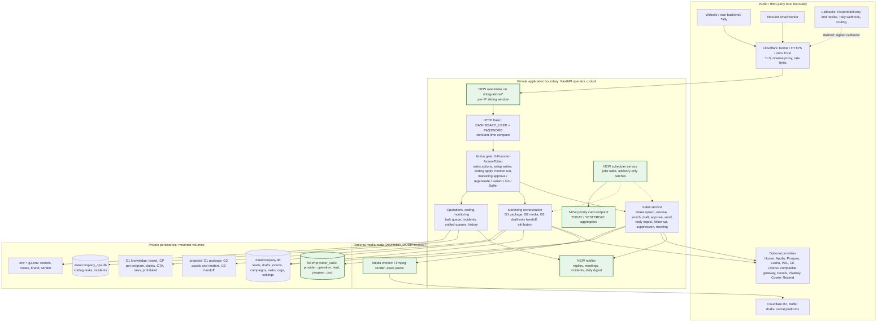
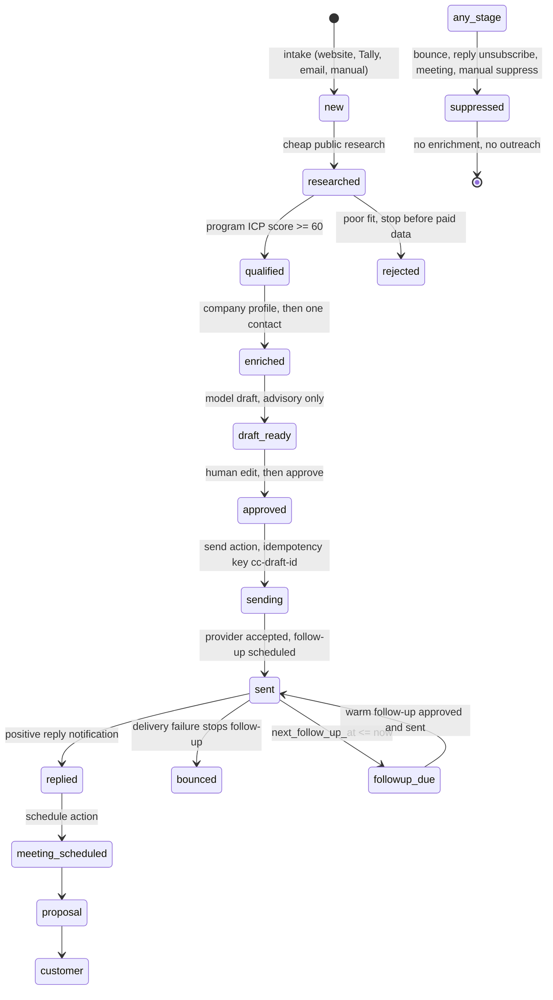
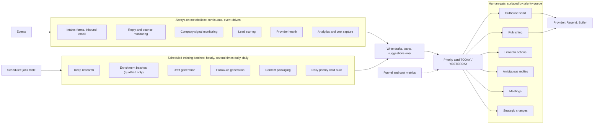
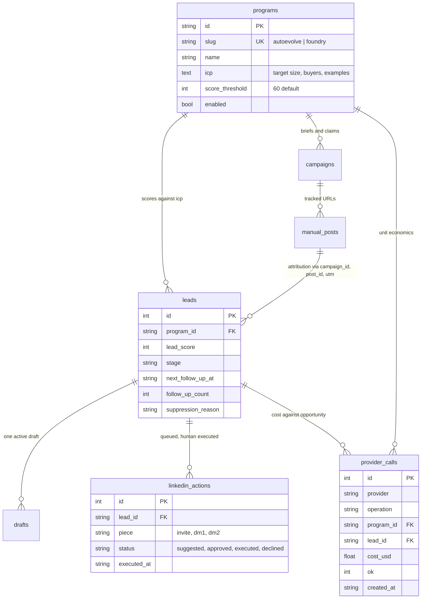
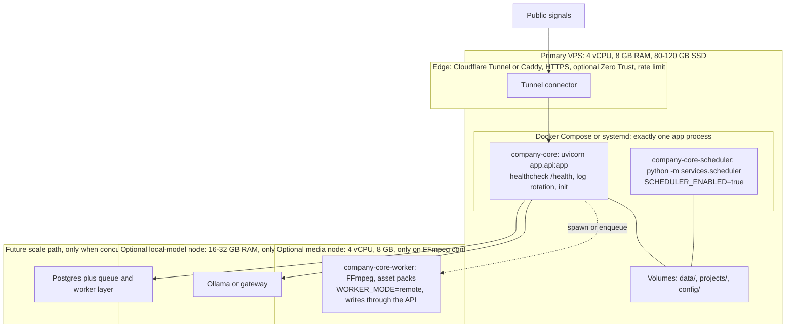

# AutoEvolve V2 Implementation Plan

Direction source: `AutoEvolve_V2_Operating_and_Infrastructure_Plan.docx` (architecture review,
24/7 operating model, hardware sizing, API-cost planning, Foundry integration).
Architecture detail source: `company-core-architecture.excalidraw` (trust boundaries + numbered
control gates) and `autoevolve-v2-infrastructure.excalidraw` (V2 node layout and operating loop).
This file is the delta between that direction and the repository as it exists today, expressed as
ordered, file-level changes.

## Sources of truth

| Artifact | Role |
| --- | --- |
| `AutoEvolve_V2_Operating_and_Infrastructure_Plan.docx` | Operating direction, sizing, commercial loops, DoD |
| `company-core-architecture.excalidraw` | Current runtime architecture, trust boundaries, gates 1-7 |
| `autoevolve-v2-infrastructure.excalidraw` | Target node layout and 24/7 operating loop |
| This repository | Implementation; code references below are authoritative |

## 1. Verified current state

Every claim drawn on the current-architecture diagram was checked against code. These hold and
require no change.

| Diagram claim | Code reference |
| --- | --- |
| Dashboard behind HTTP Basic, constant-time compare | `app/security.py` (`authenticate`) |
| `X-Founder-Action-Token` on resolving, draft change/approve/send, suppress, research | `app/sales_api.py` (`verify_founder_action`, action router) |
| Intake requires email or phone, Pydantic size caps | `app/sales_api.py` (`LeadIntake`, website/tally intake) |
| Distinct intake, email-webhook, action, dashboard secrets | `app/sales_api.py` (`_check_secret`), `.env.example` |
| Tally: intake secret plus optional HMAC over raw body | `app/sales_api.py` (`_verify_tally_signature`) |
| Resend: Svix HMAC, raw body, stale timestamps rejected | `services/sales_service.py` (`verify_resend_webhook`) |
| Approval and sending are separate actions | `core/sales_store.py` (`approve_draft`, `claim_draft_for_send`) |
| Suppressed lead cannot be enriched or sent | `services/sales_service.py` (`send_approved`, resolve paths) |
| Auto contact disabled by default, consent gated | `services/sales_service.py` (`maybe_auto_contact_lead`) |
| `force=true` is the only extra-credit path; no bulk send | `scripts/doctor.py`, `/company/sales/doctor` |
| G1 validates against knowledge and prohibited claims | `engines/g1/g1_runtime/validation.py` |
| Campaign pending review must be approved or regenerated, not retried | `app/marketing_api.py` (`approve_script`, `regenerate_script`) |
| G3 draft-only; R2 upload verified externally readable | `engines/g3/g3_runtime/r2.py` (`verify_public_media`) |
| One application process while SQLite is primary | `Dockerfile` CMD, `docs/deployment.md` |
| Mounted persistence for `data/`, `projects/`, `config/` | `compose.yaml` |
| Setup reads never return secret values | `app/setup_api.py`, `core/setup_keys.py` |
| Provider missing: dashboard stays up, feature reports disabled | `scripts/doctor.py`, sales/marketing doctor routes |

## 2. Gap summary

| Priority | Gap | Direction reference |
| --- | --- | --- |
| P0 | Send idempotency key is random per attempt; crash strands drafts in `sending` | Doc 12 Day 1, DoD |
| P0 | Action-gate holes: setup step write, coding/apply, monitor run, marketing approvals | Excalidraw gates 2 and 7, doc 3.3 |
| P0 | No rate limiting on public intake and webhook routes | Excalidraw public-entry limits, production checklist |
| P0 | Backup/restore documented only; live SQLite copied with `cp` | Doc 12 Day 1, DoD |
| P1 | No programs/ICP model for AutoEvolve and Foundry | Doc 6, 12 Day 2, DoD |
| P1 | No scheduler: no research, scoring, enrichment, follow-up or digest batches | Doc 4 |
| P1 | No follow-up state machine or due-today follow-ups | Doc 5.1, 9 |
| P1 | No operator priority card (TODAY / YESTERDAY) | Doc 9, DoD |
| P1 | No reply/meeting notifications | Doc 12 Day 2 |
| P1 | No provider cost accounting or unit economics | Doc 7 step 10, 10, DoD |
| P1 | LinkedIn drafts exist, no action queue or execution policy | Doc 8 |
| P1 | Media worker is a local subprocess, cannot move to its own node | Doc 3.2 |
| P2 | Compose has no healthcheck, log rotation or init | Doc 3.1 |
| P2 | Doctor does not check webhook secrets | Doc 3.3 |
| P2 | `.env.example` lacks scheduler, worker, notification, program keys | Doc 4, 6 |
| P2 | Doc 15 lists artifacts that are missing or misnamed in the repository | Doc 15 |
| P2 | Non-goals not written down, so future changes can drift | Doc 14 |

## 3. Target architecture

## 4. Sales loop and follow-up state machine

The follow-up state (`next_follow_up_at`, `follow_up_count`) does not exist yet. P1 change 5
adds it; this diagram is the contract to implement.

Rules that must survive implementation:

1. Generated model output is always a draft; approval and sending stay separate.
2. Suppressed state blocks enrichment and outreach on every path, including scheduler jobs.
3. `next_follow_up_at` is cleared by reply, bounce, meeting, and suppression.
4. Scheduler jobs may only create drafts, tasks, and suggestions. They never send.

## 5. 24/7 operating model

## 6. Programs and ICP data model

One deployment, two programs, as required by doc 14. No separate installs.

Seed rows: `autoevolve` (B2B companies of 5-100 employees; founder, Head of Sales, RevOps,
Growth; broad market, moderate depth) and `foundry` (AI/software buyers of verified engineering
output; low volume, deep intelligence).

## 7. Deployment topology

Non-goals from doc 14 are binding: no Postgres migration for aesthetics, no GPU by default, no
full LinkedIn automation, no provider stacking without a waterfall role, no second deployment for
Foundry.

## 8. P0 changes

### P0-1 Send idempotency

| Item | Detail |
| --- | --- |
| Problem | `services/sales_service.py` `_resend_request` sets `idempotency_key=str(uuid.uuid4())`, so a retry after a timeout sends a duplicate email |
| Change | Derive the key from the draft: `idempotency_key=f"cc-{draft_id}"`, passed from `send_approved` through `_send_resend_draft` |
| Change | Treat Resend HTTP 409 as success: the message already exists, read back the provider message id and `mark_sent` |
| Change | Crash recovery: `core/sales_store.py` gains `reconcile_sending_drafts()` called from `_on_startup` in `app/api.py`; drafts in `sending` older than a configurable window return to `approved` |
| Test | `tests/test_sales_contracts.py`: stable key across attempts, 409 path marks sent, restart reconciliation releases a stranded claim |

### P0-2 Close the action-gate holes

| Route | File | Change |
| --- | --- | --- |
| `POST /company/setup/step` | `app/setup_api.py` | Add `Depends(verify_founder_action)`; the module docstring already promises it |
| `POST /company/coding/tasks` | `app/company_ops_api.py` | Add the action-token dependency; task creation spends model budget |
| `POST /company/coding/tasks/{id}/apply` | `app/company_ops_api.py` | Add the dependency; apply mutates a workspace |
| `POST /company/monitor/run` and `/monitor/run/{service}` | `app/company_ops_api.py` | Add the dependency; monitor may run shell diagnostics and auto-repair |
| Marketing approve, regenerate, variant select, G3 create, Buffer schedule | `app/marketing_api.py` | Route-level `Depends(verify_founder_action)` on reputation-critical mutations; reads keep dashboard auth only |

Keep dashboard auth for reads so the cockpit and docs stay available when a key is missing
(excalidraw gate 1).

### P0-3 Rate limiting

| Item | Detail |
| --- | --- |
| New file | `app/ratelimit.py`: per-IP sliding window stored in memory, fail-closed option via env, returns `429` with `Retry-After` |
| Mount | `sales_intake_router` routes in `app/api.py`, plus the two webhook routes; dashboard auth failures counted separately |
| Config | `.env.example`: `RATE_LIMIT_INTAKE_PER_MINUTE=30`, `RATE_LIMIT_WEBHOOK_PER_MINUTE=120`, `RATE_LIMIT_ENABLED=true` |
| Docs | `docs/production-checklist.md` links the in-app limiter and keeps the reverse-proxy recommendation |
| Test | `tests/test_sales_api.py`: burst over the limit returns 429 and does not create a lead |

### P0-4 Backup and restore

| Item | Detail |
| --- | --- |
| New | `scripts/backup.sh`: online-safe `sqlite3 .backup` for `data/company.db` and `data/company_ops.db`, plus `.env`, `config/`, `projects/`, `engines/g3/config/g3.env`; timestamped, `chmod 600`, optional age/gpg encryption |
| New | `scripts/restore.sh --verify`: restores into a temp dir, runs `make doctor`, opens both databases, counts leads and campaigns, prints a report; refuses to overwrite a live instance |
| New | `scripts/verify_backup.py`: opens a backup archive and asserts schema and row counts |
| Make | `make backup`, `make restore`, `make verify-backup` targets |
| Docs | Rewrite `docs/upgrading.md` to stop recommending `cp -a` on a live database; add a cron example |
| DoD | "Backup and restore are tested, not merely configured" becomes a command, not a manual procedure |

## 9. P1 changes

### P1-1 Programs and ICP

| Item | Detail |
| --- | --- |
| Schema | `core/state.py`: `programs` table, seed `autoevolve` and `foundry`; `core/sales_store.py`: `program_id` column on `sales_leads` with backfill default `autoevolve` |
| Scoring | `score_lead` takes the program row: threshold, size band, buyer titles, industry exclusions; marketing campaigns store `program_id` |
| API | `app/sales_api.py`: `program_id` on intake, manual lead, research, prospect routes; default from `settings.active_program_id` |
| Briefs | `tools/research.py` and `agents/sales.py` accept a program brief; `agents/researcher.py` runs per-program market scans |
| Knowledge | Per-program ICP registry under `engines/g1/knowledge/` selected by program, claims stay shared |
| UI | Program switcher on `/operations/sales/discovery`; queue filters include program |

### P1-2 Scheduler

| Item | Detail |
| --- | --- |
| New | `services/scheduler.py`: `python -m services.scheduler`, reads `jobs` table (`name`, `interval_seconds`, `last_run_at`, `state`, `last_error`) |
| Schema | `core/state.py`: `jobs` table plus `upsert_job`, `claim_job` guard so two runners cannot overlap |
| Jobs | Market research, scoring, enrichment batches (qualified only), draft generation, follow-up generation, daily priority card build, provider health (`services/monitor.check_all`), cost digest |
| Constraint | Every job is advisory: writes drafts, tasks, suggestions. No send, no publish, no LinkedIn execution, no suppression changes |
| Config | `SCHEDULER_ENABLED`, `SCHEDULER_JOBS` allowlist in `.env.example` |
| Deploy | Optional `company-core-scheduler` service in `compose.yaml`, or in-process task when `SCHEDULER_MODE=in_process` |

### P1-3 Follow-up state

| Item | Detail |
| --- | --- |
| Schema | `sales_leads.next_follow_up_at`, `sales_leads.follow_up_count`, `sales_leads.last_outbound_at` |
| Set | On `mark_sent` (for example plus 3 days), advanced on each approved follow-up send |
| Clear | Reply, bounce, meeting, suppression, unsubscribe |
| Query | `list_followups_due(program_id)` used by scheduler and priority card |
| Guard | `send_approved` refuses a lead whose `next_follow_up_at` is in the future unless the action is the due follow-up |

### P1-4 Operator priority card

| Item | Detail |
| --- | --- |
| New | `core/dashboard.py`: `get_priority_card()` returning TODAY and YESTERDAY blocks |
| TODAY | Drafts awaiting approval, follow-ups due, LinkedIn actions suggested, positive replies, meeting requests, high-value program prospects, campaigns pending review, critical incidents |
| YESTERDAY | Delivered, replies, positive replies, provider spend, cost per qualified lead |
| API | `GET /company/operations/priority` in `app/company_ops_api.py` |
| UI | Card block at the top of `templates/operations.html` with deep links into existing queue filters |
| DoD | "The operator receives a usable daily priority queue" |

### P1-5 Notifications

| Item | Detail |
| --- | --- |
| New | `services/notify.py` with webhook, SMTP, ntfy/Gotify adapters, `NOTIFY_*` env keys |
| Triggers | Positive reply (`ingest_resend_event`, `ingest_inbound_email`), meeting scheduled, incident created, daily digest |
| Rule | Fire and forget after the response is written; a notification failure never fails a webhook |

### P1-6 Cost accounting

| Item | Detail |
| --- | --- |
| New | `core/cost_store.py`: table `provider_calls` (`provider`, `operation`, `program_id`, `lead_id`, `units`, `cost_usd`, `ok`, `created_at`) |
| Instrument | One `_record()` call in `services/apollo.py`, `hunter.py`, `prospeo.py`, `lusha.py`, `pdl.py`, `company_enrich.py`, `linkedin_discovery.py`, and model gateway calls in `services/sales_service.py` and `core/models.py` |
| Rates | `COST_TABLE` env-overridable cents per call, unknown rates recorded as `units` with `cost_usd = 0` and flagged |
| Expose | `GET /company/operations/costs`: spend by program, `$ / qualified lead`, `$ / meeting`, revenue per API dollar |
| Rule from doc | Store provider cost against the opportunity, so unit economics are measurable |

### P1-7 Funnel metrics

Extend `core/sales_store.py::summary()` with researched, qualified, resolved, approved, delivered,
bounced, replied, positive, meetings, plus bounce and reply rates; add marketing attribution chain
counts from `campaign_id`/`post_id`/UTM on leads. This is doc section 10 in code form.

### P1-8 LinkedIn action queue

| Item | Detail |
| --- | --- |
| Schema | `linkedin_actions` table with `suggested`, `approved`, `executed`, `declined` |
| API | List suggested actions, approve, mark executed; all writes require the action token |
| Policy | Human executes account actions. The system may only suggest and record, never automate |
| UI | Filter chip in `templates/operations_sales.html` feeding the priority card |

### P1-9 Worker split for media

| Item | Detail |
| --- | --- |
| Change | `services/marketing_worker.py::spawn` and `services/asset_pack_worker.py` choose a backend from `WORKER_MODE`: `local` keeps `subprocess.Popen`, `remote` enqueues or runs a configured command such as SSH |
| Constraint | SQLite stays single writer, so the remote worker writes through the app API or only touches `projects/` on shared storage |
| Compose | Optional `company-core-worker` service with FFmpeg, no ports |
| Docs | `docs/deployment.md`: when to move media off the primary node (doc 3.2) |

## 10. P2 changes

| Change | Files |
| --- | --- |
| Add `healthcheck` on `/health`, `init: true`, json-file log rotation options | `compose.yaml` |
| Require `SALES_RESEND_WEBHOOK_SECRET`, `SALES_EMAIL_WEBHOOK_SECRET`, `TALLY_WEBHOOK_SECRET`; report `bulk_send: false` | `scripts/doctor.py` |
| Add `SCHEDULER_ENABLED`, `SCHEDULER_MODE`, `WORKER_MODE`, `NOTIFY_*`, `RATE_LIMIT_*`, `PROGRAM_*` | `.env.example`, `scripts/init_env.sh` |
| Fix artifact list: file is `company-core-architecture.excalidraw`, add `autoevolve-v2-infrastructure.excalidraw` | `AutoEvolve_V2_Operating_and_Infrastructure_Plan.docx` section 15 |
| Add a non-goals section mirroring doc 14 | `README.md`, `docs/non-goals.md` |
| Keep one process explicit, add reverse-proxy rate-limit example | `docs/deployment.md` |

## 11. Rollout order

```mermaid
flowchart LR
  subgraph DAY1["Day 1: deployment hardening"]
    A1["P0-1 idempotency"]
    A2["P0-2 action gates"]
    A3["P0-3 rate limits"]
    A4["P0-4 backup and restore"]
    A5["Deploy internal VPS instance, verify restart and restore"]
  end
  subgraph DAY2["Day 2: commercial operating loop"]
    B1["P1-1 two programs"]
    B2["P1-2 scheduler"]
    B3["P1-3 follow-ups"]
    B4["P1-4 priority card"]
    B5["P1-5 notifications"]
    B6["P1-6 cost accounting"]
  end
  subgraph WEEK1["Week 1: calibration"]
    C1["Use internally daily"]
    C2["Collect delivery, reply, meeting, cost data"]
    C3["Log repetitive manual steps as automation candidates"]
    C4["Turn internal use into the sales proof"]
  end
  DAY1 --> DAY2 --> WEEK1
```

## 12. Definition of done mapping

| Doc 13 criterion | Covered by |
| --- | --- |
| Fresh deployment from documentation on a clean VPS | Existing docs plus P2 compose and doctor changes |
| Survives restart without losing critical state | P0-1 send reconciliation, existing mounted volumes |
| Backup and restore tested | P0-4 |
| One lead provider and one AI provider end to end | Existing, verified by `make doctor` |
| Sales loop research through reply and meeting | Existing loop plus P1-3 follow-ups |
| Marketing loop brief through publish handoff and attribution | Existing G1 to G3 chain |
| Forms and inbound events become prioritized leads | Existing intake plus P1-4 priority card |
| High-impact actions cannot bypass approvals | P0-2 gate closure |
| Provider failures visible and isolated | Existing `services/monitor.py` plus scheduled health job |
| Usable daily priority queue | P1-4 |
| AutoEvolve and Foundry as separate programs | P1-1 |
| Cost per qualified opportunity measurable | P1-6, P1-7 |
| Used internally as the acquisition engine before scaling | Week 1 calibration |

## 13. What not to build

1. Do not migrate off SQLite for aesthetics. Migrate when concurrency or availability requires it.
2. Do not add a GPU unless local inference has a measurable cost, privacy, or latency advantage.
3. Do not enrich every discovered contact; qualify first, then spend.
4. Do not automate LinkedIn account actions end to end.
5. Do not stack providers without an explicit waterfall role.
6. Do not let self-improvement rewrite ICP, claims, or messaging from small samples.
7. Do not confuse content volume with pipeline creation.
8. Do not create a second AutoEvolve deployment for Foundry; keep two programs in one system.
